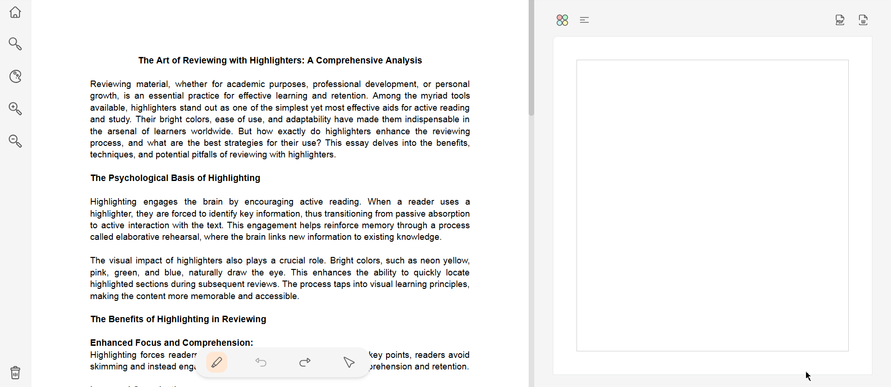

# SWIFTEXT

SwiftText is a versatile productivity tool designed for efficient text management. It allows users to upload and work with PDF, Word, and image files, providing custom highlighting, tagging, and exporting features. SwiftText is ideal for users who need to organize and format text quickly for summaries, reports, and other structured documents.

## Features

- Custom Highlighting: Select and color-code text to match predefined formats (e.g., Heading 1, Heading 2).
- Real-Time Preview: See live updates as you highlight, format, and edit.
- Export Options: Export highlighted text in various formats, such as Word or PDF, with structured formatting.
- File Management: Organize files, add tags, search, and filter through uploaded documents.

## Technologies used

- Frontend: React.js + Tailwind CSS for a responsive, modern UI
- Backend: Node.js + Express.js for server logic
- Database: PostgreSQL for structured data, DynamoDB for scalable NoSQL needs

## Hosting

- Frontend: Amazon S3
- Backend: Render Web Server (Docker)
- Database: Render PostgreSQL, Amazon DynamoDB (noSQL DB)

## In Progress

- Serverless Deployment: Implementing serverless architecture on the AWS platform using AWS ECR and Docker
- CI/CD Pipeline: Setting up a streamlined, automated build and deployment process with GitHub Actions
